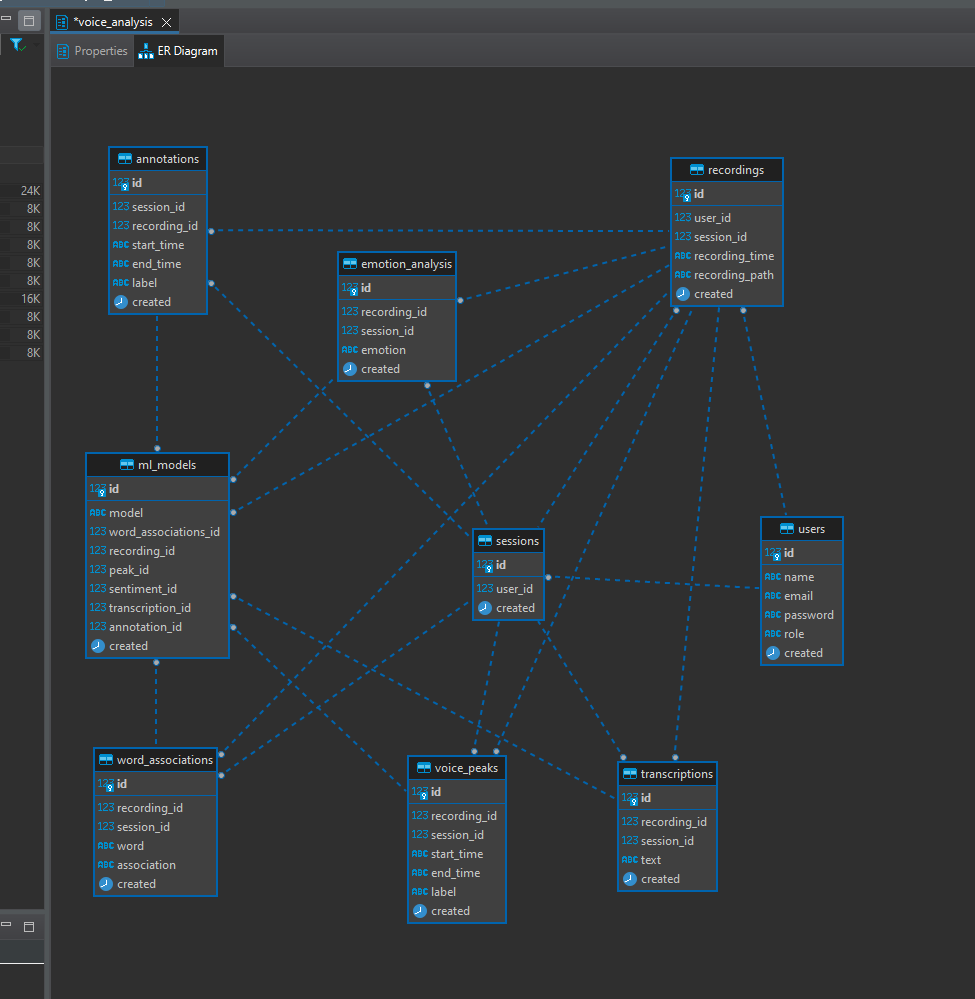
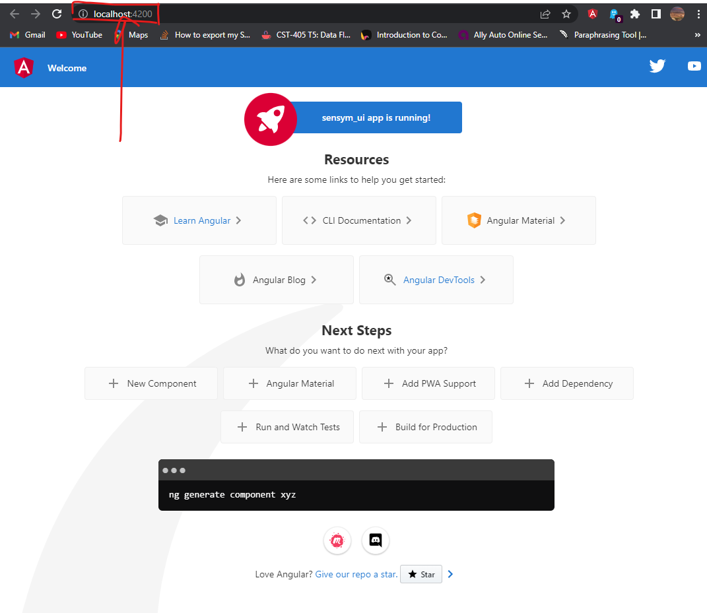

# sensym

****

### Backend design workflow


****
### Git workflow


****
### Create Python Environment
```bash 
$ py -3.11 -m venv venv
```
****

### Activate Python Environment
windows:
```bash 
$ ./venv/Scripts/activate
```
or 

```bash 
$ source ./venv/Scripts/activate
```

Mac/Linux:
```bash
$ source ./venv/bin/activate
```

****

### Install all dependencies, db_models and apis for sensym_db_models

```bash
$ ./local/install_dependencies/sensym_db_models.sh
```

****


database: sensym_care

Schema: Voice_analysis

Tables:

users
- id (primary key)
- name
- email
- password
- role ENUM (e.g. "admin", 'doctor')

recordings
- id (primary key)
- user_id (foreign key referencing users.id)
- start_time
- end_time
- file_path (path to the audio file on the server)

annotations
- id (primary key)
- recording_id (foreign key referencing recordings.id)
- start_time (in seconds)
- end_time (in seconds)
- label (e.g. "happy", "sad")
- confidence (a decimal value between 0 and 1 indicating the confidence of the annotation)

transcriptions
- id (primary key)
- recording_id (foreign key referencing recordings.id)
- text
- confidence (a decimal value between 0 and 1 indicating the confidence of the transcription)

emotion_analysis
- id (primary key)
- recording_id (foreign key referencing recordings.id)
- emotion (e.g. "happy", "sad")
- confidence (a decimal value between 0 and 1 indicating the confidence of the emotion detection)

voice_peaks
- id (primary key)
- recording_id (foreign key referencing recordings.id)
- start_time (in seconds)
- end_time (in seconds)
- label (e.g. "question", "exclamation")
- confidence (a decimal value between 0 and 1 indicating the confidence of the peak detection)

word_associations
- id (primary key)
- recording_id (foreign key referencing recordings.id)
- word
- association (e.g. "emotion", "topic")
- confidence (a decimal value between 0 and 1 indicating the confidence of the association)

sessions
- id (primary key)
- user_id (foreign key referencing users.id)
- start_time
- end_time
- status (e.g. "active", "expired")





Focus on the file **matchRules.ipynb**. It contains the main code to analyze journals (see *Journals* folder)

You can *commit* files to this repository directly from GitHub. This will be the repository for all our code.

Check this: https://www.geeksforgeeks.org/plotting-various-sounds-on-graphs-using-python-and-matplotlib/


****
## Angular Build and Run

- ### First make sure that you have Node v18.12.1 or newer installed:
  - https://nodejs.org/en/download/
- run ```node --version``` in your terminal to make sure you have installed it :

- Once you have node, go ahead and install Angular CLI:
```bash
$ npm install -g @angular/cli
```
Note that if you are running this on Windows powershell, you will need to change ExecutionPolicy:
```bash
$ Set-ExecutionPolicy -Scope CurrentUser -ExecutionPolicy RemoteSigned
```

Once you get these done, you can run build and run the project:
```bash
$ cd lqs_ui
```
then
```bash
$ ng serve --open
```
Now you should see the following:



## Python Requirements
The SenSym2 project is supported on Python 3.9.10. Moreover, the following packages are required to run each component of the project:
- General: sys, pprint, tabulate, array
- MongoDB: pymongo
- Django: python3-django
- ML: tensorflow, pytorch
- Math/Science: numpy, matplotlib, scikit-learn
- Automation: pyautogui
- Natural Language Processing: spacy, nltk
- Keyword Extraction: rake_nltk
- Image Processing: opencv-python (cv2), imutils
- Sound Processing: wave
- Voice & Speech Recognition: pyttsx3, speech_recognition
- Data Visualization: wordcloud
- Packages for WIP efforts: cmath, concurrent.futures, email.mime, multiprocessing, pyqtgraph, threading, struct, pyaudio, scipy, time, numba, subprocess, tkinter

