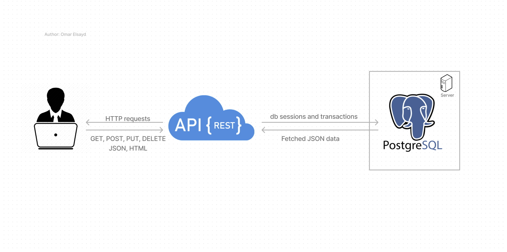
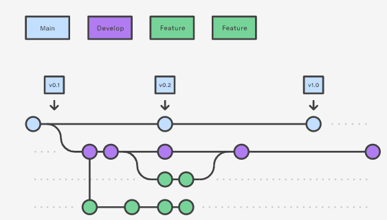

# Lecture-Quiz-Software

****

### Backend design workflow


****
### Git workflow


****
### Create Python Environment
```bash 
$ py -3.11 -m venv venv
```
****

### Activate Python Environment
windows:
```bash 
$ ./venv/Scripts/activate
```
or 

```bash 
$ source ./venv/Scripts/activate
```

Mac/Linux:
```bash
$ source ./venv/bin/activate
```

****

### Install all dependencies, db_models and apis for sensym_db_models

```bash
$ ./local/install_dependencies/sensym_db_models.sh
```

****


database:

Schema: Voice

Tables:

users
- id (primary key)
- name
- email
- password
- role (e.g. "admin", "user")

recordings
- id (primary key)
- user_id (foreign key referencing users.id)
- start_time
- end_time
- file_path (path to the audio file on the server)

annotations
- id (primary key)
- recording_id (foreign key referencing recordings.id)
- start_time (in seconds)
- end_time (in seconds)
- label (e.g. "happy", "sad")
- confidence (a decimal value between 0 and 1 indicating the confidence of the annotation)

transcriptions
- id (primary key)
- recording_id (foreign key referencing recordings.id)
- text
- confidence (a decimal value between 0 and 1 indicating the confidence of the transcription)

emotion_analysis
- id (primary key)
- recording_id (foreign key referencing recordings.id)
- emotion (e.g. "happy", "sad")
- confidence (a decimal value between 0 and 1 indicating the confidence of the emotion detection)

voice_peaks
- id (primary key)
- recording_id (foreign key referencing recordings.id)
- start_time (in seconds)
- end_time (in seconds)
- label (e.g. "question", "exclamation")
- confidence (a decimal value between 0 and 1 indicating the confidence of the peak detection)

word_associations
- id (primary key)
- recording_id (foreign key referencing recordings.id)
- word
- association (e.g. "emotion", "topic")
- confidence (a decimal value between 0 and 1 indicating the confidence of the association)

sessions
- id (primary key)
- user_id (foreign key referencing users.id)
- start_time
- end_time
- status (e.g. "active", "expired")

pip install alembic

